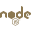

# 👋🏻👨🏻‍💻 Hi! I'm Mateo

 

Im a software developer from Córdoba, Argentina, whose passions are both software development and learning whatever I can. I have a Full Stack web development background, though I find myself leaning in favour of the front-end side of things.
 

### 🍂 **Languages & Tools**

 

### 🍂 **Projects**

#### **Videogame App**
