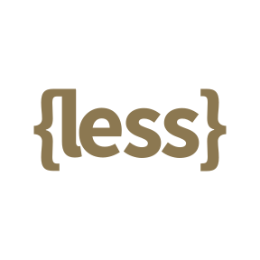
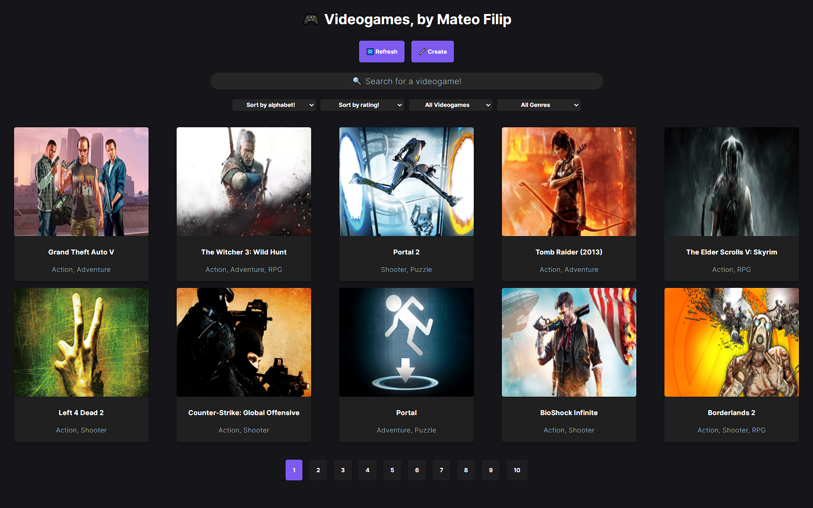

# ✌🏻 Hey! I'm Mateo Filip

**I'm a software developer from Argentina, whose passions are both coding and learning whatever I can. I have a Full Stack web development background, though I find myself leaning in favour of the front-end side of things. I want to keep growing more and more in the tech world, developing solutions for all types of problems people in the planet may have, meeting spectacular people to make teams with and learn from, while also growing both as a professional and as a person.**

**Should you want to know more about me, feel free to read below!**

---

## 🍂 **Languages & Tools**

 

## 🍂 **Projects**

### **» Videogame App**

## 🍂 **Contact Me!**

<a href="https://www.linkedin.com/in/mateofilip">  &nbsp;
<a href="mailto:mateofernandofilip@gmail.com"> &nbsp;
<a href="https://twitter.com/mateofilip_">
